# APPartment
APPartment lets you organize in a clean and simple way the houseworks, with an intriguing reward system.  
The app is made in Java with Firebase for the backend.

## Key functionalities
* [Sign-in / Sign-up](#sign-in--sign-up)
* [User profile page](#user-profile-page)
* [Home page](#home-page)
  * [Board](#board)
  * [Home's members](#homes-members)
  * [To-Do](#to-do)
  * [Done](#done)
  * [Rewards](#rewards)
  
### Sign-in / Sign-up
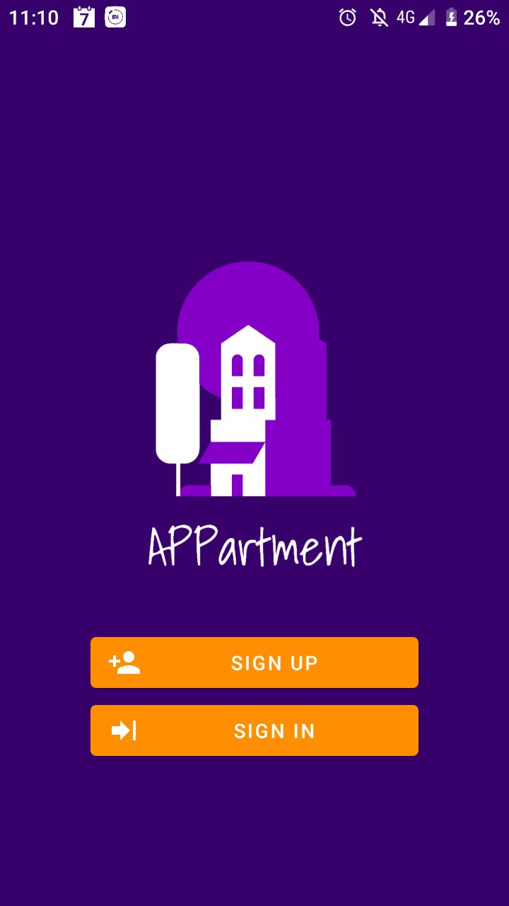 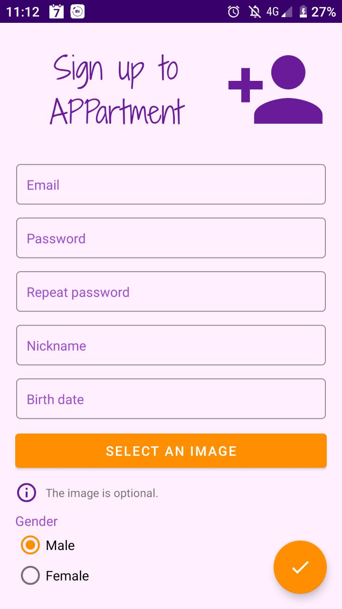  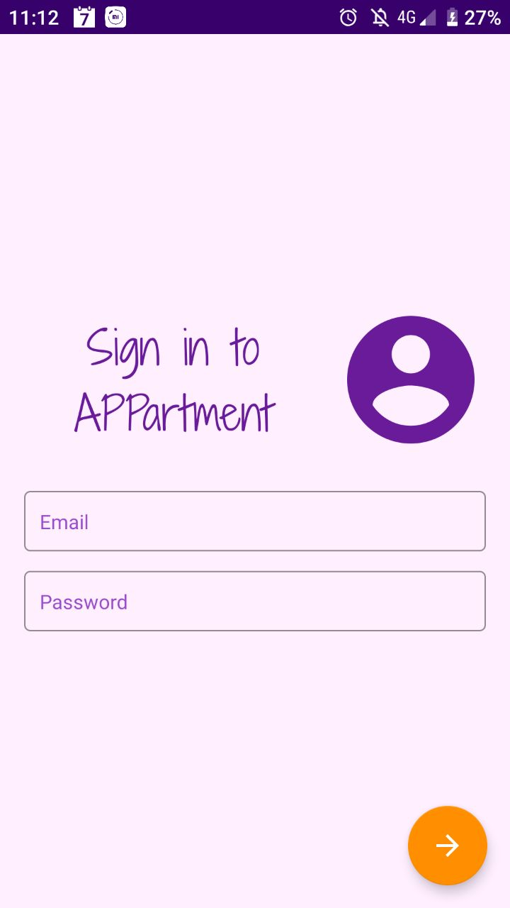  
  
To start using the application you must first sign-up or sign-in.  
You do that once and then you get automatically logged-in!  

### User profile page
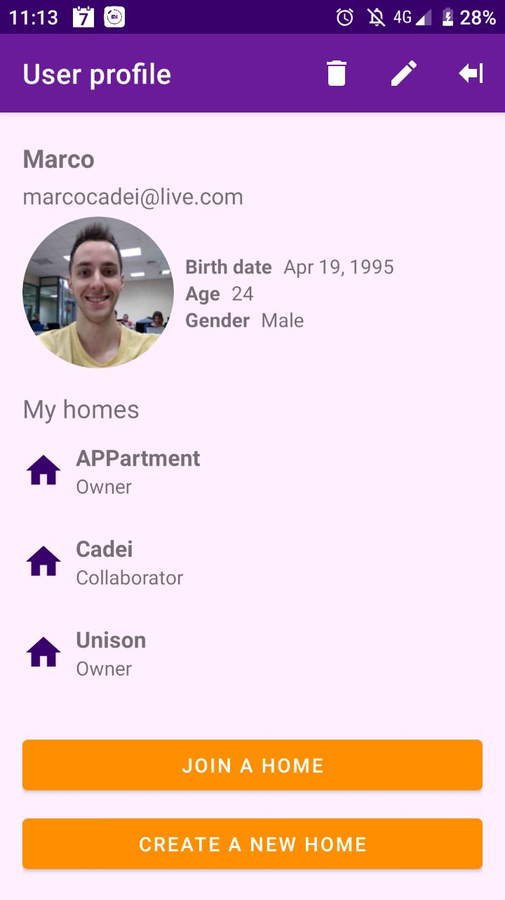  
  
From your profile page you can create a new home or join an existing one.  
Once you join a home it will appear in the "My homes" list so that you can enter in it istantly, just by tapping it.  

### Home page  
Once you've enterd in a home you will see all of his pages, between which you can navigate using the bottom navigation or a swipe.  
If you close the application while you're in a house when you will re-open the app you will be taken to the same house.  
### Board  
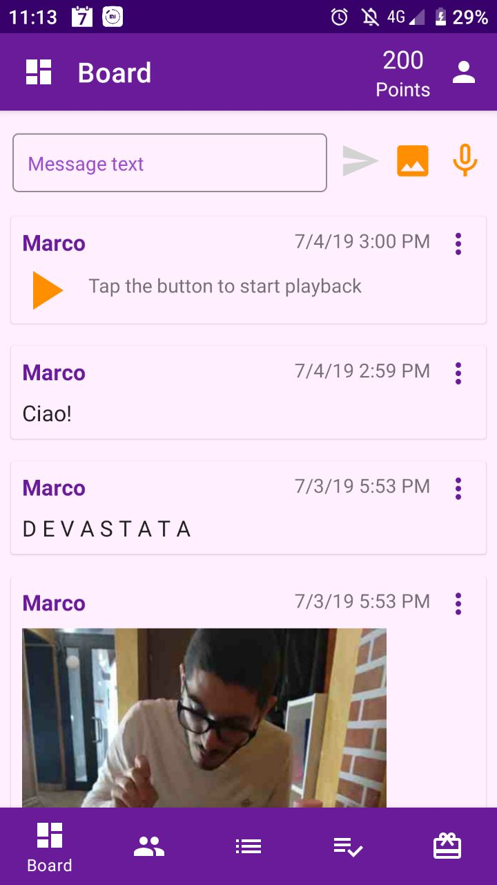  
  
The board is where members of the house can share some notes.  
You can think of it as a replacement for the post-it on the refrigerator!  
Members of the house can share text, image or audio posts!  

### Home's members  
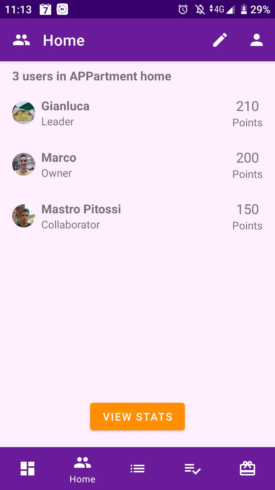 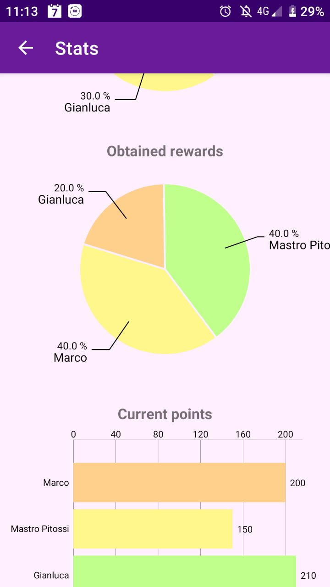 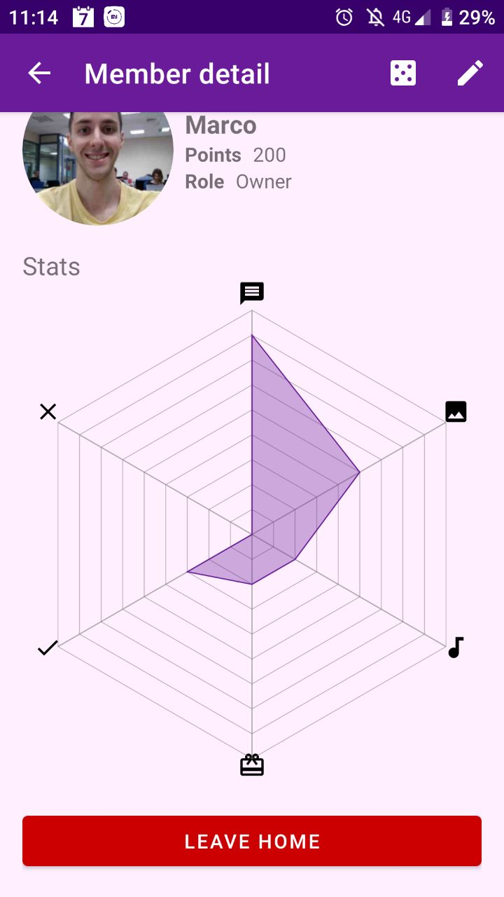  
  
From this page you can see the list of the members of the house with their respective role.  
We distinguish three roles:
* *Owner* --> there can only be one for each home and can downgrade/upgrade the role of each member, approve completions of tasks, ecc.  
* *Leader* --> there can be many for each home and can downgrade/upgrade the role of collaborators, approve completions of tasks, ecc.  
* *Collaborator* --> there can be many for each home and many of their activities require a confirmation by a leader or the owner  

The users can see some stats about the house, shown in nice charts made with [MPAndroidChart](https://github.com/PhilJay/MPAndroidChart).  
There are also some stats for each member of the home.  

### To-Do
 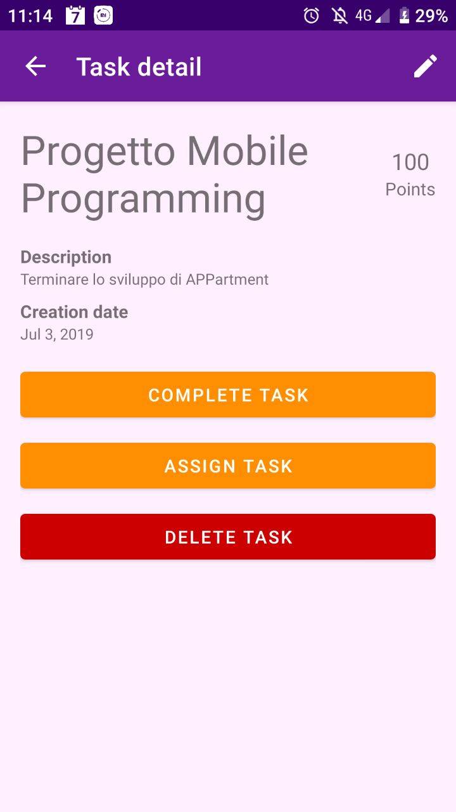 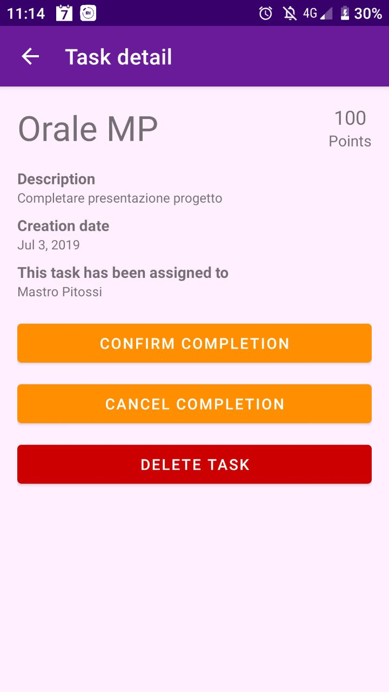  
  
The To-Do list is where the things that need to be done are shown.  
Tasks are added by leader or the owner and they can be assigned to some user.  
Collaborators can assign free tasks to themselves, complete them and then ask for verification.  
Each task comes with a certain point amount associated to it. Once you complete it you'll get those points!  
As you can see the leader can perform different actions based on the state of the task itself: if it is marked as complete, assigned or free different options are available.  

### Done  
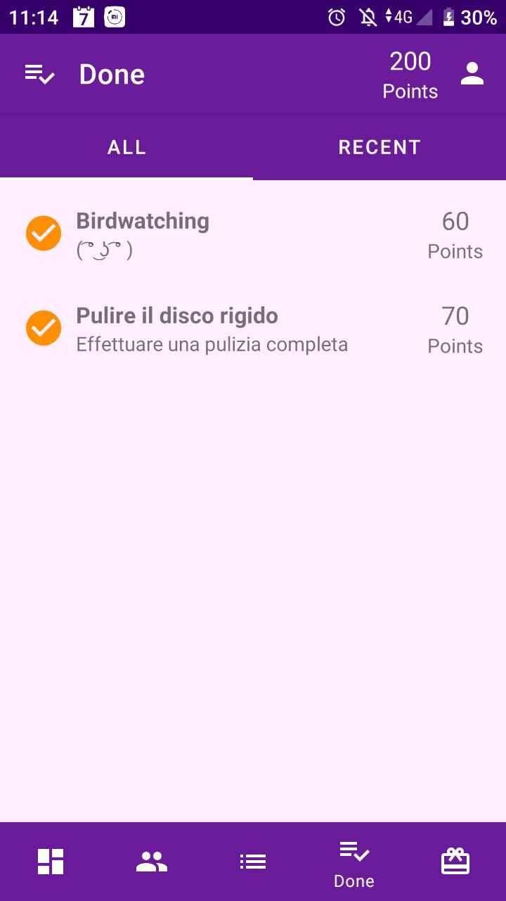 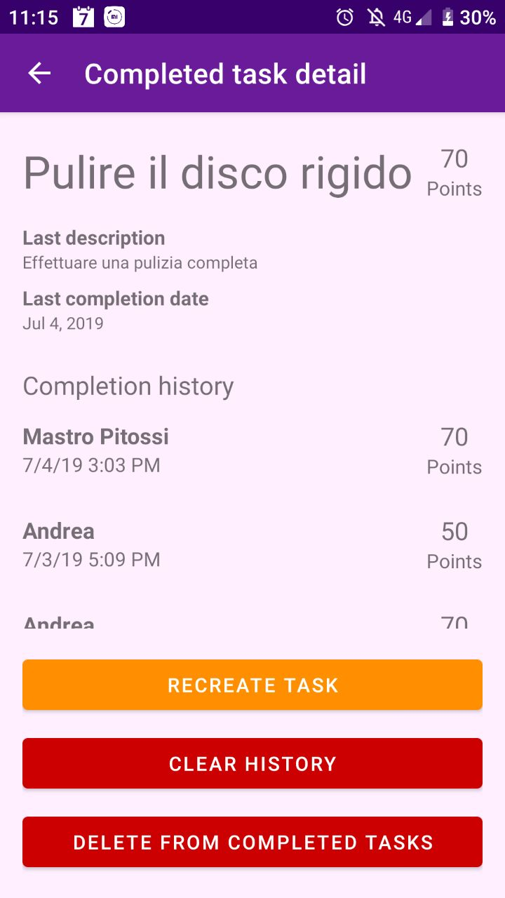  
  
Once a task is completed and approved it will appear in the list of completed tasks.  
Completed tasks are grouped together by their name, therefore if you complete two tasks with the same name you won't see two different records
in the list, but a single item with a completion history with two records in it.  
This is done because there are many recurrent tasks and no one wants to see a list full of "clean the floor".  
Moreover a new task can be created from a completed one.  

### Rewards
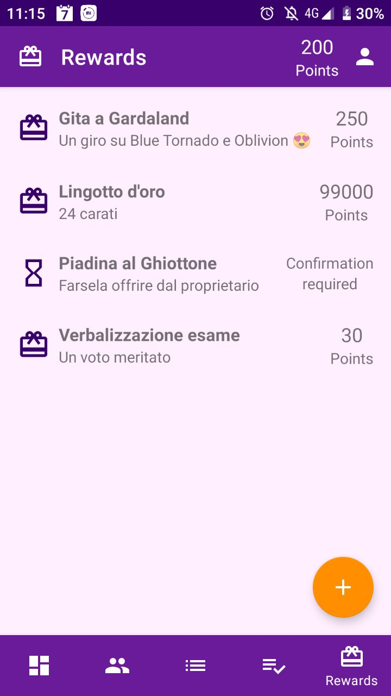 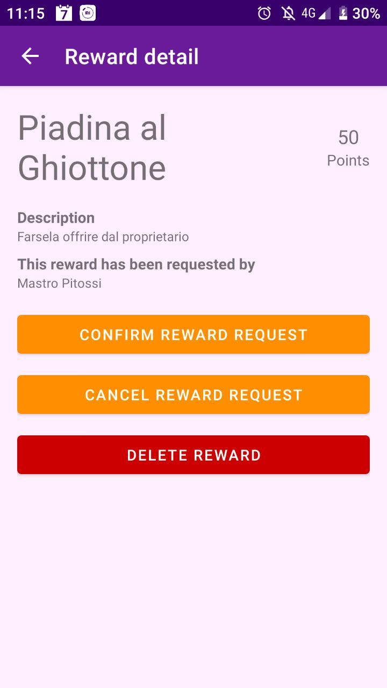  
  
Once you've accumulated enough points you can ask for a reward! :tada:  
Those are created by a leader or the owner, which establishes an amount of points associated to it.  

## Contributors
I've made this project with [Gianluca Roscigno](https://github.com/gianluca150) and [Andrea Pitossi](https://github.com/AndreaPitossi).
